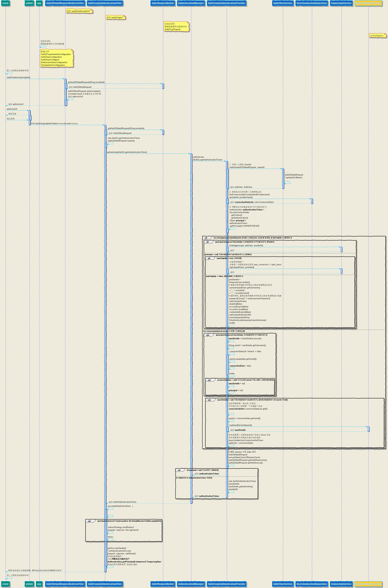

# Spring security 集成 JustAuth 实现第三方授权登录脚手架: 


## 一、`特性`

[Spring security 集成 JustAuth 实现第三方授权登录](https://github.com/ZeroOrInfinity/justAuth-spring-boot-security-starter): 此项目从 **用户管理脚手架**(UMS):https://github.com/ZeroOrInfinity/UMS | https://gitee.com/pcore/UMS) 项目中分离.
1. 支持所有 justAuth 支持的第三方登录，登录后自动注册或绑定.
2. 支持定时刷新 accessToken 分布式定时任务,
3. 支持第三方授权登录的用户信息表与 token 信息表的 redis 缓存功能.
4. 支持第三方绑定与解绑及查询接口(top.dcenter.ums.security.core.oauth.repository.UsersConnectionRepository).

微信群：UMS 添加微信(z56133)备注(UMS) 
------
## 二、`maven`：

```xml
<dependency>
    <groupId>top.dcenter</groupId>
    <artifactId>justAuth-spring-security-starter</artifactId>
    <version>latest</version>
</dependency>
```

------
## 三、`快速开始(Quick Start)`：

### 1. 添加依赖(Add Dependency):

```xml
<dependency>
    <groupId>top.dcenter</groupId>
    <artifactId>justAuth-spring-security-starter</artifactId>
    <version>latest</version>
</dependency>

<dependency>
    <groupId>org.springframework.boot</groupId>
    <artifactId>spring-boot-starter-web</artifactId>
    <version>2.3.4.RELEASE</version>
</dependency>

<!-- mysql -->
<dependency>
    <groupId>mysql</groupId>
    <artifactId>mysql-connector-java</artifactId>
    <version>8.0.21</version>
</dependency>

<!-- 第三方授权登录默认会按照下面的优先级自行寻找一种 HTTP 工具依赖，java 11 HttpClient -> OkHttp3 -> apache HttpClient -> hutool-http
     示例使用 apache HttpClient .
     注意: 如果是 JDK11 则不需要此依赖-->
<dependency>
    <groupId>org.apache.httpcomponents</groupId>
    <artifactId>httpclient</artifactId>
    <version>4.5.12</version>
</dependency>
```
#### 依赖说明: 如果是 JDK-1.8 环境, 任选一种 HTTP 工具依赖，项目内如果已有，请忽略。另外需要特别注意，如果项目中已经引入了低版本的依赖，请先排除低版本以后来，引入高版本或者最新版本的依赖

- `hutool-http`
```xml
<dependency>
    <groupId>cn.hutool</groupId>
    <artifactId>hutool-http</artifactId>
    <version>5.2.5</version>
</dependency>
```
- `httpclient`
```xml
<dependency>
	<groupId>org.apache.httpcomponents</groupId>
  	<artifactId>httpclient</artifactId>
  	<version>4.5.12</version>
</dependency>
```
- `okhttp`
```xml
<dependency>
  <groupId>com.squareup.okhttp3</groupId>
  <artifactId>okhttp</artifactId>
  <version>4.4.1</version>
</dependency>
```
### 2. config:  

```yaml
server:
  port: 9090

spring:
  profiles:
    active: dev
  # mysql
  datasource:
    driver-class-name: com.mysql.cj.jdbc.Driver
    url: jdbc:mysql://127.0.0.1:3306/ums?useSSL=false&useUnicode=true&characterEncoding=UTF-8&zeroDateTimeBehavior=convertToNull&serverTimezone=Asia/Shanghai
    username: root
    password: 123456

  # session 简单配置
  session:
    # session 存储模式设置, 要导入相应的 spring-session 类的依赖, 默认为 none, 分布式应用把 session 放入 redis 等中间件
    store-type: none
    # session 过期时间
    timeout: PT300s

# ums core
ums:
  # ================ 第三方授权登录相关配置 ================
  oauth:
    # 是否支持第三方授权登录功能, 默认: true
    enabled: true
    # 抑制反射警告, 支持 JDK11, 默认: false , 在确认 WARNING: An illegal reflective access operation has occurred 安全后, 可以打开此设置, 可以抑制反射警告.
    suppress-reflect-warning: true
    # 第三方服务商: providerId, 支持所有 JustAuth 支持的第三方授权登录, 目前有 32 家第三方授权登录
    github:
      # 根据是否有设置 clientId 来动态加载相应 JustAuth 的 AuthXxxRequest
      client-id: 4d4ee00e82f669f2ea8d
      client-secret: 953ddbe871a08d6924053531e89ecc01d87195a8
    gitee:
      client-id: dcc38c801ee88f43cfc1d5c52ec579751c12610c37b87428331bd6694056648e
      client-secret: e60a110a2f6e7c930c2d416f802bec6061e19bfa0ceb0df9f6b182b05d8f5a58
    # 第三方登录授权登录 url 前缀, 不包含 ServletContextPath，默认为 /auth2/authorization.
    auth-login-url-prefix: /auth2/authorization
    # 第三方登录回调处理 url 前缀 ，也就是 RedirectUrl 的前缀, 不包含 ServletContextPath，默认为 /auth2/login.
    redirect-url-prefix: /auth2/login
    # 第三方登录回调的域名, 例如：http://localhost:9090 默认为 "http://127.0.0.1"，
    # redirectUrl 直接由 {domain}/{servletContextPath}/{redirectUrlPrefix}/{providerId}(ums.oauth.[qq/gitee/weibo])组成
    domain: http://localhost:9090
    # 第三方授权登录成功后的默认权限, 多个权限用逗号分开, 默认为: "ROLE_USER"
    default-authorities: ROLE_USER

    # 用于 JustAuth 的代理(HttpClient)设置
    proxy:      
      # 用于国内代理(HttpClient)超时, 默认 PT3S
      timeout: PT3S
      # 用于国外网站代理(HttpClient)超时, 默认 PT15S
      foreign-timeout: PT150S  
---
spring:
  profiles: dev
  mvc:
    throw-exception-if-no-handler-found: true

#debug: true

server:
  port: 9090
  servlet:
    context-path: /demo
```
### 3. 必须实现 UmsUserDetailsService 接口:

#### UserDetailsServiceImpl.java

```java
import me.zhyd.oauth.model.AuthUser;
import org.springframework.beans.factory.annotation.Autowired;
import org.springframework.security.core.GrantedAuthority;
import org.springframework.security.core.authority.AuthorityUtils;
import org.springframework.security.core.userdetails.User;
import org.springframework.security.core.userdetails.UserCache;
import org.springframework.security.core.userdetails.UserDetails;
import org.springframework.security.core.userdetails.UsernameNotFoundException;
import org.springframework.security.crypto.password.PasswordEncoder;
import org.springframework.stereotype.Service;
import top.dcenter.ums.security.core.oauth.enums.ErrorCodeEnum;
import top.dcenter.ums.security.core.oauth.exception.RegisterUserFailureException;
import top.dcenter.ums.security.core.oauth.exception.UserNotExistException;
import top.dcenter.ums.security.core.oauth.service.UmsUserDetailsService;

import java.util.List;

/**
 *  用户密码与手机短信登录与注册服务：<br><br>
 *  1. 用于第三方登录与手机短信登录逻辑。<br><br>
 *  2. 用于用户密码登录逻辑。<br><br>
 *  3. 用户注册逻辑。<br><br>
 * @author YongWu zheng
 * @version V1.0  Created by 2020/9/20 11:06
 */
@Service
public class UserDetailsServiceImpl implements UmsUserDetailsService {

    private final Logger log = LoggerFactory.getLogger(this.getClass());

    @SuppressWarnings("SpringJavaAutowiredFieldsWarningInspection")
    @Autowired(required = false)
    private UserCache userCache;
    /**
     * 用于密码加解密
     */
    @SuppressWarnings("SpringJavaAutowiredFieldsWarningInspection")
    @Autowired
    private PasswordEncoder passwordEncoder;

    @SuppressWarnings("AlibabaUndefineMagicConstant")
    @Override
    public UserDetails loadUserByUsername(String username) throws UsernameNotFoundException {

        try
        {
            // 从缓存中查询用户信息:
            // 从缓存中查询用户信息
            if (this.userCache != null)
            {
                UserDetails userDetails = this.userCache.getUserFromCache(username);
                if (userDetails != null)
                {
                    return userDetails;
                }
            }
            // 根据用户名获取用户信息

            // 获取用户信息逻辑。。。
            // ...

            // 示例：只是从用户登录日志表中提取的信息，
            log.info("Demo ======>: 登录用户名：{}, 登录成功", username);
            return new User(username,
                            passwordEncoder.encode("admin"),
                            true,
                            true,
                            true,
                            true,
                            AuthorityUtils.commaSeparatedStringToAuthorityList("ROLE_VISIT, ROLE_USER"));

        }
        catch (Exception e)
        {
            String msg = String.format("Demo ======>: 登录用户名：%s, 登录失败: %s", username, e.getMessage());
            log.error(msg, e);
            throw new UserNotExistException(ErrorCodeEnum.QUERY_USER_INFO_ERROR, e, username);
        }
    }

   @Override
    public UserDetails registerUser(AuthUser authUser, String username, String defaultAuthority, String decodeState) throws RegisterUserFailureException {

        // 第三方授权登录不需要密码, 这里随便设置的, 生成环境按自己的逻辑
        String encodedPassword = passwordEncoder.encode(authUser.getUuid());

        // 这里的 decodeState 可以根据自己实现的 top.dcenter.ums.security.core.oauth.service.Auth2StateCoder 接口的逻辑来传递必要的参数.
        // 比如: 第三方登录成功后的跳转地址
        final RequestAttributes requestAttributes = RequestContextHolder.getRequestAttributes();
        // 假设 decodeState 就是 redirectUrl, 我们直接把 redirectUrl 设置到 request 上
        // 后续经过成功处理器时直接从 requestAttributes.getAttribute("redirectUrl", RequestAttributes.SCOPE_REQUEST) 获取并跳转
        requestAttributes.setAttribute("redirectUrl", decodeState, RequestAttributes.SCOPE_REQUEST);
        // 当然 decodeState 也可以传递从前端传到后端的用户信息, 注册到本地用户
        
        List<GrantedAuthority> grantedAuthorities = AuthorityUtils.commaSeparatedStringToAuthorityList(defaultAuthority);

        // ... 用户注册逻辑

        log.info("Demo ======>: 用户名：{}, 注册成功", username);

        // @formatter:off
        UserDetails user = User.builder()
                               .username(username)
                               .password(encodedPassword)
                               .disabled(false)
                               .accountExpired(false)
                               .accountLocked(false)
                               .credentialsExpired(false)
                               .authorities(grantedAuthorities)
                               .build();
        // @formatter:off

        // 把用户信息存入缓存
        if (userCache != null)
        {
            userCache.putUserInCache(user);
        }

        return user;
    }

    @Override
    public UserDetails loadUserByUserId(String userId) throws UsernameNotFoundException {
        UserDetails userDetails = loadUserByUsername(userId);
        User.withUserDetails(userDetails);
        return User.withUserDetails(userDetails).build();
    }

    @Override
    public List<Boolean> existedByUsernames(String... usernames) throws UsernameNotFoundException {
        // ... 在本地账户上查询 userIds 是否已被使用
        List<Boolean> list = new ArrayList<>();
        list.add(true);
        list.add(false);
        list.add(false);
        
        return list;
    }

}
```

### 4. 必须添加 top.dcenter.ums.security.core.oauth.config.Auth2AutoConfigurer 到 HttpSecurity

#### WebSecurityConfig.java

```java
import org.springframework.beans.factory.annotation.Autowired;
import org.springframework.context.annotation.Bean;
import org.springframework.context.annotation.Configuration;
import org.springframework.http.HttpMethod;
import org.springframework.security.config.annotation.web.builders.HttpSecurity;
import org.springframework.security.config.annotation.web.configuration.WebSecurityConfigurerAdapter;
import org.springframework.security.crypto.factory.PasswordEncoderFactories;
import org.springframework.security.crypto.password.PasswordEncoder;
import top.dcenter.ums.security.core.oauth.config.Auth2AutoConfigurer;
import top.dcenter.ums.security.core.oauth.properties.Auth2Properties;

/**
 * web security config
 * @author YongWu zheng
 * @version V2.0  Created by 2020/10/18 22:39
 */
@Configuration
public class WebSecurityConfig extends WebSecurityConfigurerAdapter {

    @Autowired
    private Auth2AutoConfigurer auth2AutoConfigurer;
    @Autowired
    private Auth2Properties auth2Properties;

    @Bean
    public PasswordEncoder passwordEncoder() {
        /*
            默认为 BCryptPasswordEncoder 的实现了添加随机 salt 算法，并且能从hash后的字符串中获取 salt 进行原始密码与hash后的密码的对比
            支持格式:
            {bcrypt}$2a$10$dXJ3SW6G7P50lGmMkkmwe.20cQQubK3.HZWzG3YB1tlRy.fqvM/BG
            {noop}password
            {pbkdf2}5d923b44a6d129f3ddf3e3c8d29412723dcbde72445e8ef6bf3b508fbf17fa4ed4d6b99ca763d8dc
            {scrypt}$e0801$8bWJaSu2IKSn9Z9kM+TPXfOc/9bdYSrN1oD9qfVThWEwdRTnO7re7Ei+fUZRJ68k9lTyuTeUp4of4g24hHnazw==$OAOec05+bXxvuu/1qZ6NUR+xQYvYv7BeL1QxwRpY5Pc=
            {sha256}97cde38028ad898ebc02e690819fa220e88c62e0699403e94fff291cfffaf8410849f27605abcbc0
         */
        return PasswordEncoderFactories.createDelegatingPasswordEncoder();
    }

    @Override
    protected void configure(HttpSecurity http) throws Exception {

        http.formLogin()
            .loginPage("/login.html")
            .defaultSuccessUrl("/index.html");
        http.logout().logoutSuccessUrl("/login.html");

        http.csrf().disable();

        // ========= start: 使用 justAuth-spring-security-starter 必须步骤 ========= 
        // 添加 Auth2AutoConfigurer 使 OAuth2(justAuth) login 生效.
        http.apply(this.auth2AutoConfigurer);

        // 放行第三方登录入口地址与第三方登录回调地址
        // @formatter:off
        http.authorizeRequests()
                .antMatchers(HttpMethod.GET,
                             auth2Properties.getRedirectUrlPrefix() + "/*",
                             auth2Properties.getAuthLoginUrlPrefix() + "/*")
                .permitAll();
        // @formatter:on
        // ========= end: 使用 justAuth-spring-security-starter 必须步骤 ========= 

        http.authorizeRequests().anyRequest().permitAll();
    }
}
```

### 4. 前端页面 :

#### login.html: 放在 classpath:/static

```html
<!DOCTYPE html>
<html>
<head>
    <meta charset="UTF-8">
    <title>登录</title>

</head>
<body>
<h2>登录页面</h2>
<h3>社交登录</h3>
<a href="/demo/auth2/authorization/gitee">gitee登录</a>
<a href="/demo/auth2/authorization/github">github登录</a>
<a href="/demo/auth2/authorization/qq">qq登录</a>
</body>
</html>
```
#### index.html: 放在 classpath:/static

```html
<!DOCTYPE html>
<html>
<head>
    <meta charset="UTF-8">
    <title>index</title>
</head>
<body>
hello world!<br>
    <form action="/demo/logout?logout" method="post">
        <input type="submit" value="退出登录post"/>
    </form>

<br>
<br>
<a href="/demo/auth2/authorization/gitee">gitee登录</a>
<a href="/demo/auth2/authorization/github">github登录</a>
<a href="/demo/auth2/authorization/qq">qq登录</a>
</body>
</html>
```
### 5. 访问前端页面

- 浏览器访问 `http://localhost:9090/demo/login.html`, 至此集成了：第三方登录([justAuth-spring-security-starter](https://github.com/ZeroOrInfinity/justAuth-spring-security-starter)); 实现快速开发。
- 详细配置配置在: [justAuth-security-oauth2-example](https://github.com/ZeroOrInfinity/justAuth-spring-security-starter/tree/master/demo/justAuth-security-oauth2-example)
------

## 四、使用说明:

### 1. `引入依赖`

```xml
<dependency>
    <groupId>top.dcenter</groupId>
    <artifactId>justAuth-spring-security-starter</artifactId>
    <version>1.0.2</version>
</dependency>
```
### 2. `必须实现的接口`    

   - 本地用户服务: [UmsUserDetailsService](https://github.com/ZeroOrInfinity/justAuth-spring-security-starter/blob/master/src/main/java/top/dcenter/ums/security/core/oauth/service/UmsUserDetailsService.java)    
### 3. `必须添加 Auth2AutoConfigurer 到 HttpSecurity` 

```java
@Configuration
public class WebSecurityConfig extends WebSecurityConfigurerAdapter {

    @Autowired
    private Auth2AutoConfigurer auth2AutoConfigurer;
    @Autowired
    private Auth2Properties auth2Properties;

    @Override
    protected void configure(HttpSecurity http) throws Exception {

        // ========= start: 使用 justAuth-spring-security-starter 必须步骤 ========= 
        // 添加 Auth2AutoConfigurer 使 OAuth2(justAuth) login 生效.
        http.apply(this.auth2AutoConfigurer);

        // 放行第三方登录入口地址与第三方登录回调地址
        // @formatter:off
        http.authorizeRequests()
                .antMatchers(HttpMethod.GET,
                             auth2Properties.getRedirectUrlPrefix() + "/*",
                             auth2Properties.getAuthLoginUrlPrefix() + "/*")
                .permitAll();
        // @formatter:on
        // ========= end: 使用 justAuth-spring-security-starter 必须步骤 ========= 

    }
}
```
### 4. `接口介绍`

- justAuth-spring-security-starter 大部分功能实现都是通过配置文件设置属性来完成的, 详细属性配置请查看`五、属性配置列表`.
------
## 五、接口说明: 

- [UmsUserDetailsService](https://github.com/ZeroOrInfinity/justAuth-spring-security-starter/blob/master/src/main/java/top/dcenter/ums/security/core/oauth/service/UmsUserDetailsService.java): `必须实现`

- [Auth2StateCoder](https://github.com/ZeroOrInfinity/justAuth-spring-security-starter/blob/master/src/main/java/top/dcenter/ums/security/core/oauth/service/Auth2StateCoder.java): `用户需要时实现`, 对第三方授权登录流程中的 state 进行自定义编解码. 可以传递必要的信息, 
  如: 第三方登录成功的跳转地址等 注意此接口的两个方法必须同时实现对应的编解码逻辑, 实现此接口后注入 IOC 容器即可, 如有前端向后端获取 authorizeUrl
  时向后端传递额外参数 且用作注册时的信息, 需配合 UmsUserDetailsService.registerUser(AuthUser, String, String, String) 方法实现.

- [Auth2UserService](https://github.com/ZeroOrInfinity/justAuth-spring-security-starter/blob/master/src/main/java/top/dcenter/ums/security/core/oauth/service/Auth2UserService.java): 获取第三方用户信息的接口, 一般**不需要用户实现**, 除非想自定义获取第三方用户信息的逻辑, 实现此接口注入 IOC 容器即可替代.

- [UsersConnectionRepository](https://github.com/ZeroOrInfinity/justAuth-spring-security-starter/blob/master/src/main/java/top/dcenter/ums/security/core/oauth/repository/UsersConnectionRepository.java): 第三方授权登录的第三方用户信息增删改查, 绑定与解绑及查询是否绑定与解绑接口, 一般**不需要用户实现**. 
  除非想自定义获取第三方用户信息的逻辑, 实现此接口注入 IOC 容器即可替代.

- [UsersConnectionTokenRepository](https://github.com/ZeroOrInfinity/justAuth-spring-security-starter/blob/master/src/main/java/top/dcenter/ums/security/core/oauth/repository/UsersConnectionTokenRepository.java): 第三方授权登录用户 accessToken 信息表增删改查接口, 一般**不需要用户实现**. 
  除非想自定义获取第三方用户信息的逻辑, 实现此接口注入 IOC 容器即可替代.

- [ConnectionService](https://github.com/ZeroOrInfinity/justAuth-spring-security-starter/blob/master/src/main/java/top/dcenter/ums/security/core/oauth/signup/ConnectionService.java): 第三方授权登录用户的注册, 绑定, 更新第三方用户信息与 accessToken 信息的接口, 一般**不需要用户实现**.
  除非想自定义获取第三方用户信息的逻辑, 实现此接口注入 IOC 容器即可替代.

------
## 六、`时序图(Sequence Diagram)`: 随着版本迭代会有出入



------
## 七、`属性配置列表`

###  OAuth2 / refreshToken 定时任务 / JustAuth 配置属性

| **属性**                                                     | **类型**       | **默认值**           | **描述**                                                     | **可选项**            |
| ------------------------------------------------------------ | -------------- | -------------------- | ------------------------------------------------------------ | --------------------- |
| ums.oauth.enabled                                            | Boolean        | true                 | 是否支持第三方授权登录功能, 默认: true                       | true/false            |
| ums.oauth.autoSignUp                                            | Boolean        | true                 | 第三方授权登录后如未注册用户是否支持自动注册功能, 默认: true                       | true/false            |
| ums.oauth.temporaryUserPassword                                            | String        | ""                 | 用于第三方授权登录时, 未开启自动注册且用户是第一次授权登录的临时用户密码, 默认为: "". 注意: 生产环境更换密码                       |             |
| ums.oauth.temporaryUserAuthorities                                            | String        | "ROLE_TEMPORARY_USER"                 | 用于第三方授权登录时, 未开启自动注册且用户是第一次授权登录的临时用户的默认权限, 多个权限用逗号分开, 默认为: "ROLE_TEMPORARY_USER"                       |             |
| ums.oauth.domain                                             | String         | http://127.0.0.1     | 第三方登录回调的域名, 例如：https://localhost 默认为 "http://127.0.0.1"， redirectUrl 直接由 `{domain}/{servletContextPath}/{redirectUrlPrefix}/{providerId}(ums.oauth.[qq/gitee/weibo])`组成 |                       |
| ums.oauth.redirectUrlPrefix                                  | String         | /oauth/login         | 第三方登录回调处理 url 前缀 ，也就是 `RedirectUrl` 的前缀, 不包含 `ServletContextPath`，默认为 `/oauth/login` |                       |
| ums.oauth.authLoginUrlPrefix                                 | String         | /oauth/authorization | 第三方登录授权登录 url 前缀, 不包含 `ServletContextPath`，默认为 `/oauth/authorization` |                       |
| ums.oauth.temporaryUserAuthorities                                 | String         | ROLE_USER            | 第三方授权登录成功后的默认权限, 多个权限用逗号分开, 默认为: "ROLE_USER" |                       |
| ums.oauth.suppressReflectWarning                | Boolean                 | false                                  | 抑制反射警告, 支持 JDK11, 默认: false , 在确认 WARNING: An illegal reflective access operation has occurred 安全后, 可以打开此设置, 可以抑制反射警告. | true/false                         |
| **refreshToken 定时任务**                                    |                |                      |                                                              |                       |
| ums.oauth.refreshTokenJobCron                                | String         | 0 * 2 * * ?          | A cron-like expression.<br/>       `0 * 2 * * ?` 分别对应: `second/minute/hour/day of month/month/day of week`<br/>       <br/>默认为: "0 * 2 * * ?", 凌晨 2 点启动定时任务, 支持分布式(分布式 IOC 容器中必须有 `RedisConnectionFactory`, 也就是说, 是否分布式执行依据 IOC 容器中是否有 `RedisConnectionFactory`) |                       |
| ums.oauth.enableRefreshTokenJob                              | Boolean        | false                | 是否支持定时刷新 `AccessToken` 定时任务. 默认: false. 支持分布式(分布式 IOC 容器中必须有 `RedisConnectionFactory`, 也就是说, 是否分布式执行依据 IOC 容器中是否有 `RedisConnectionFactory`) | true/false            |
| ums.oauth.batchCount                                         | Integer        | 1000                 | 定时刷新 `accessToken` 任务时, 批处理数据库的记录数. 注意: 分布式应用时, 此配置不同服务器配置必须是一样的. `batchCount` 大小需要根据实际生产环境进行优化 |                       |
| ums.oauth.remainingExpireIn                                  | Integer        | 24                   | `accessToken` 的剩余有效期内进行刷新 `accessToken`, 默认: 24, 单位: 小时. 注意: 需要根据实际生产环境进行优化 |                       |
| **justAuth**                                                 |                |                      |                                                              |                       |
| ums.oauth.justAuth.ignoreCheckState                          | Boolean        | false                | 忽略校验 state 参数，默认不开启。当 ignoreCheckState 为 true 时， me.zhyd.oauth.request.AuthDefaultRequest.login(AuthCallback) 将不会校验 state 的合法性。<br/>使用场景：当且仅当使用自实现 state 校验逻辑时开启<br/>以下场景使用方案仅作参考： 1. 授权、登录为同端，并且全部使用 JustAuth 实现时，该值建议设为 false; 2. 授权和登录为不同端实现时，比如前端页面拼装 authorizeUrl，并且前端自行对state进行校验， 后端只负责使用code获取用户信息时，该值建议设为 true; 如非特殊需要，不建议开启这个配置<br/>该方案主要为了解决以下类似场景的问题： | true/false            |
| ums.oauth.justAuth.timeout                                   | Duration       | PT180S               | 默认 state 缓存过期时间：3分钟(PT180S) 鉴于授权过程中，根据个人的操作习惯，或者授权平台的不同（google等），每个授权流程的耗时也有差异，不过单个授权流程一般不会太长 本缓存工具默认的过期时间设置为3分钟，即程序默认认为3分钟内的授权有效，超过3分钟则默认失效，失效后删除 |                       |
| ums.oauth.justAuth.cacheType                                 | StateCacheType | SESSION              | JustAuth state 缓存类型, 默认 session                        | DEFAULT/SESSION/REDIS |
| ums.oauth.justAuth.cacheKeyPrefix                            | String         | JUST_AUTH:           | JustAuth state 缓存 key 前缀                                 |                       |
| ums.oauth.justAuth.scopes                                    | List<String>   |                      | 支持自定义授权平台的 scope 内容                              |                       |
| **proxy**                                                    |                |                      |                                                              |                       |
| ums.oauth.proxy.enable                                       | Boolean        | false                | 是否支持代理, 默认为: false. 当为 false 时, 其他属性都失效.  | true/false            |
| ums.oauth.proxy.proxy                                        | Proxy.Type     | HTTP                 | 针对国外服务可以单独设置代理类型, 默认 Proxy.Type.HTTP       | HTTP/DIRECT/SOCKS     |
| ums.oauth.proxy.hostname                                     | String         |                      | 代理 host, enable = true 时生效.                             |                       |
| ums.oauth.proxy.port                                         | Integer        |                      | 代理端口, enable = true 时生效.                              |                       |
| ums.oauth.proxy.timeout                                      | Duration       | PT3S                 | 代理超时, 默认 PT3S                                          |                       |
| ums.oauth.proxy.foreignTimeout                               | Duration       | PT15S                | 用于国外网站代理超时, 默认 PT15S                             |                       |
| **github**                                                   |                |                      |                                                              |                       |
| ums.oauth.github.providerId                                  | String         | github               | 第三方服务商 id                                              |                       |
| ums.oauth.github.clientId                                    | String         |                      | `client Id`                                                  |                       |
| ums.oauth.github.clientSecret                                | String         |                      | `client Secret`                                              |                       |
| **weibo**                                                    |                |                      |                                                              |                       |
| ums.oauth.weibo.providerId                                   | String         | weibo                | 第三方服务商 id                                              |                       |
| ums.oauth.weibo.clientId                                     | String         |                      | `client Id`                                                  |                       |
| ums.oauth.weibo.clientSecret                                 | String         |                      | `client Secret`                                              |                       |
| **gitee**                                                    |                |                      |                                                              |                       |
| ums.oauth.gitee.providerId                                   | String         | gitee                | 第三方服务商 id                                              |                       |
| ums.oauth.gitee.clientId                                     | String         |                      | `client Id`                                                  |                       |
| ums.oauth.gitee.clientSecret                                 | String         |                      | `client Secret`                                              |                       |
| **dingtalk**                                                 |                |                      |                                                              |                       |
| ums.oauth.dingtalk.providerId                                | String         | dingtalk             | 第三方服务商 id                                              |                       |
| ums.oauth.dingtalk.clientId                                  | String         |                      | `client Id`                                                  |                       |
| ums.oauth.dingtalk.clientSecret                              | String         |                      | `client Secret`                                              |                       |
| **baidu**                                                    |                |                      |                                                              |                       |
| ums.oauth.baidu.providerId                                   | String         | baidu                | 第三方服务商 id                                              |                       |
| ums.oauth.baidu.clientId                                     | String         |                      | `client Id`                                                  |                       |
| ums.oauth.baidu.clientSecret                                 | String         |                      | `client Secret`                                              |                       |
| **csdn**: 注意：该平台已不支持                               |                |                      |                                                              |                       |
| ums.oauth.csdn.providerId                                    | String         | csdn                 | 第三方服务商 id                                              |                       |
| ums.oauth.csdn.clientId                                      | String         |                      | `client Id`                                                  |                       |
| ums.oauth.csdn.clientSecret                                  | String         |                      | `client Secret`                                              |                       |
| **coding**                                                   |                |                      |                                                              |                       |
| ums.oauth.coding.providerId                                  | String         | coding               | 第三方服务商 id                                              |                       |
| ums.oauth.coding.clientId                                    | String         |                      | `client Id`                                                  |                       |
| ums.oauth.coding.clientSecret                                | String         |                      | `client Secret`                                              |                       |
| ums.oauth.coding.codingGroupName                             | String         |                      | 使用 Coding 登录时，需要传该值。<br/>团队域名前缀，比如以“ https://justauth.coding.net/ ”为例，``codingGroupName = justauth` |                       |
| **oschina**                                                  |                |                      |                                                              |                       |
| ums.oauth.oschina.providerId                                 | String         | oschina              | 第三方服务商 id                                              |                       |
| ums.oauth.oschina.clientId                                   | String         |                      | `client Id`                                                  |                       |
| ums.oauth.oschina.clientSecret                               | String         |                      | `client Secret`                                              |                       |
| **alipay**                                                   |                |                      |                                                              |                       |
| ums.oauth.alipay.providerId                                  | String         | alipay               | 第三方服务商 id                                              |                       |
| ums.oauth.alipay.clientId                                    | String         |                      | `client Id`                                                  |                       |
| ums.oauth.alipay.clientSecret                                | String         |                      | `client Secret`                                              |                       |
| ums.oauth.alipay.alipayPublicKey                             | String         |                      | 支付宝公钥：当选择支付宝登录时，该值可用 对应“RSA2(SHA256)密钥”中的“支付宝公钥” |                       |
| **qq**                                                       |                |                      |                                                              |                       |
| ums.oauth.qq.providerId                                      | String         | qq                   | 第三方服务商 id                                              |                       |
| ums.oauth.qq.clientId                                        | String         |                      | `client Id`                                                  |                       |
| ums.oauth.qq.clientSecret                                    | String         |                      | `client Secret`                                              |                       |
| ums.oauth.qq.unionId                                         | String         |                      | 是否需要申请 unionId，默认: false. 目前只针对qq登录 注：qq授权登录时，获取 unionId 需要单独发送邮件申请权限。如果个人开发者账号中申请了该权限，可以将该值置为true，在获取openId时就会同步获取unionId 参考链接：http://wiki.connect.qq.com/unionid%E4%BB%8B%E7%BB%8D |                       |
| **wechatOpen**                                               |                |                      |                                                              |                       |
| ums.oauth.wechatOpen.providerId                              | String         | wechatOpen           | 第三方服务商 id                                              |                       |
| ums.oauth.wechatOpen.clientId                                | String         |                      | `client Id`                                                  |                       |
| ums.oauth.wechatOpen.clientSecret                            | String         |                      | `client Secret`                                              |                       |
| **wechatMp**                                                 |                |                      |                                                              |                       |
| ums.oauth.wechatMp.providerId                                | String         | wechatMp             | 第三方服务商 id                                              |                       |
| ums.oauth.wechatMp.clientId                                  | String         |                      | `client Id`                                                  |                       |
| ums.oauth.wechatMp.clientSecret                              | String         |                      | `client Secret`                                              |                       |
| **taobao**                                                   |                |                      |                                                              |                       |
| ums.oauth.taobao.providerId                                  | String         | taobao               | 第三方服务商 id                                              |                       |
| ums.oauth.taobao.clientId                                    | String         |                      | `client Id`                                                  |                       |
| ums.oauth.taobao.clientSecret                                | String         |                      | `client Secret`                                              |                       |
| **google**                                                   |                |                      |                                                              |                       |
| ums.oauth.google.providerId                                  | String         | google               | 第三方服务商 id                                              |                       |
| ums.oauth.google.clientId                                    | String         |                      | `client Id`                                                  |                       |
| ums.oauth.google.clientSecret                                | String         |                      | `client Secret`                                              |                       |
| **facebook**                                                 |                |                      |                                                              |                       |
| ums.oauth.facebook.providerId                                | String         | facebook             | 第三方服务商 id                                              |                       |
| ums.oauth.facebook.clientId                                  | String         |                      | `client Id`                                                  |                       |
| ums.oauth.facebook.clientSecret                              | String         |                      | `client Secret`                                              |                       |
| **github**                                                   |                |                      |                                                              |                       |
| ums.oauth.github.providerId                                  | String         | github               | 第三方服务商 id                                              |                       |
| ums.oauth.github.clientId                                    | String         |                      | `client Id`                                                  |                       |
| ums.oauth.github.clientSecret                                | String         |                      | `client Secret`                                              |                       |
| **douyin**                                                   |                |                      |                                                              |                       |
| ums.oauth.douyin.providerId                                  | String         | douyin               | 第三方服务商 id                                              |                       |
| ums.oauth.douyin.clientId                                    | String         |                      | `client Id`                                                  |                       |
| ums.oauth.douyin.clientSecret                                | String         |                      | `client Secret`                                              |                       |
| **linkedin**                                                 |                |                      |                                                              |                       |
| ums.oauth.linkedin.providerId                                | String         | linkedin             | 第三方服务商 id                                              |                       |
| ums.oauth.linkedin.clientId                                  | String         |                      | `client Id`                                                  |                       |
| ums.oauth.linkedin.clientSecret                              | String         |                      | `client Secret`                                              |                       |
| **microsoft**                                                |                |                      |                                                              |                       |
| ums.oauth.microsoft.providerId                               | String         | microsoft            | 第三方服务商 id                                              |                       |
| ums.oauth.microsoft.clientId                                 | String         |                      | `client Id`                                                  |                       |
| ums.oauth.microsoft.clientSecret                             | String         |                      | `client Secret`                                              |                       |
| **mi**                                                       |                |                      |                                                              |                       |
| ums.oauth.mi.providerId                                      | String         | mi                   | 第三方服务商 id                                              |                       |
| ums.oauth.mi.clientId                                        | String         |                      | `client Id`                                                  |                       |
| ums.oauth.mi.clientSecret                                    | String         |                      | `client Secret`                                              |                       |
| **toutiao**                                                  |                |                      |                                                              |                       |
| ums.oauth.toutiao.providerId                                 | String         | toutiao              | 第三方服务商 id                                              |                       |
| ums.oauth.toutiao.clientId                                   | String         |                      | `client Id`                                                  |                       |
| ums.oauth.toutiao.clientSecret                               | String         |                      | `client Secret`                                              |                       |
| **teambition**                                               |                |                      |                                                              |                       |
| ums.oauth.teambition.providerId                              | String         | teambition           | 第三方服务商 id                                              |                       |
| ums.oauth.teambition.clientId                                | String         |                      | `client Id`                                                  |                       |
| ums.oauth.teambition.clientSecret                            | String         |                      | `client Secret`                                              |                       |
| **renren**                                                   |                |                      |                                                              |                       |
| ums.oauth.renren.providerId                                  | String         | renren               | 第三方服务商 id                                              |                       |
| ums.oauth.renren.clientId                                    | String         |                      | `client Id`                                                  |                       |
| ums.oauth.renren.clientSecret                                | String         |                      | `client Secret`                                              |                       |
| **pinterest**                                                |                |                      |                                                              |                       |
| ums.oauth.pinterest.providerId                               | String         | pinterest            | 第三方服务商 id                                              |                       |
| ums.oauth.pinterest.clientId                                 | String         |                      | `client Id`                                                  |                       |
| ums.oauth.pinterest.clientSecret                             | String         |                      | `client Secret`                                              |                       |
| **stackOverflow**                                            |                |                      |                                                              |                       |
| ums.oauth.stackOverflow.providerId                           | String         | stackOverflow        | 第三方服务商 id                                              |                       |
| ums.oauth.stackOverflow.clientId                             | String         |                      | `client Id`                                                  |                       |
| ums.oauth.stackOverflow.clientSecret                         | String         |                      | `client Secret`                                              |                       |
| ums.oauth.stackOverflow.stackOverflowKey                     | String         |                      | Stack Overflow Key                                           |                       |
| **huawei**                                                   |                |                      |                                                              |                       |
| ums.oauth.huawei.providerId                                  | String         | huawei               | 第三方服务商 id                                              |                       |
| ums.oauth.huawei.clientId                                    | String         |                      | `client Id`                                                  |                       |
| ums.oauth.huawei.clientSecret                                | String         |                      | `client Secret`                                              |                       |
| **wechatEnterprise**                                         |                |                      |                                                              |                       |
| ums.oauth.wechatEnterprise.providerId                        | String         | wechatEnterprise     | 第三方服务商 id                                              |                       |
| ums.oauth.wechatEnterprise.clientId                          | String         |                      | `client Id`                                                  |                       |
| ums.oauth.wechatEnterprise.clientSecret                      | String         |                      | `client Secret`                                              |                       |
| ums.oauth.wechatEnterprise.agentId                           | String         |                      | 企业微信，授权方的网页应用ID                                 |                       |
| **kujiale**                                                  |                |                      |                                                              |                       |
| ums.oauth.kujiale.providerId                                 | String         | kujiale              | 第三方服务商 id                                              |                       |
| ums.oauth.kujiale.clientId                                   | String         |                      | `client Id`                                                  |                       |
| ums.oauth.kujiale.clientSecret                               | String         |                      | `client Secret`                                              |                       |
| **gitlab**                                                   |                |                      |                                                              |                       |
| ums.oauth.gitlab.providerId                                  | String         | gitlab               | 第三方服务商 id                                              |                       |
| ums.oauth.gitlab.clientId                                    | String         |                      | `client Id`                                                  |                       |
| ums.oauth.gitlab.clientSecret                                | String         |                      | `client Secret`                                              |                       |
| **meituan**                                                  |                |                      |                                                              |                       |
| ums.oauth.meituan.providerId                                 | String         | meituan              | 第三方服务商 id                                              |                       |
| ums.oauth.meituan.clientId                                   | String         |                      | `client Id`                                                  |                       |
| ums.oauth.meituan.clientSecret                               | String         |                      | `client Secret`                                              |                       |
| **eleme**                                                    |                |                      |                                                              |                       |
| ums.oauth.eleme.providerId                                   | String         | eleme                | 第三方服务商 id                                              |                       |
| ums.oauth.eleme.clientId                                     | String         |                      | `client Id`                                                  |                       |
| ums.oauth.eleme.clientSecret                                 | String         |                      | `client Secret`                                              |                       |
| **twitter**                                                  |                |                      |                                                              |                       |
| ums.oauth.twitter.providerId                                 | String         | twitter              | 第三方服务商 id                                              |                       |
| ums.oauth.twitter.clientId                                   | String         |                      | `client Id`                                                  |                       |
| ums.oauth.twitter.clientSecret                               | String         |                      | `client Secret`                                              |                       |
| **feishu**: 注意：该平台暂时存在问题，请不要使用。待修复完成后会重新发版by yadong.zhang |                |                      |                                                              |                       |
| ums.oauth.feishu.providerId                                  | String         | feishu               | 第三方服务商 id                                              |                       |
| ums.oauth.feishu.clientId                                    | String         |                      | `client Id`                                                  |                       |
| ums.oauth.feishu.clientSecret                                | String         |                      | `client Secret`                                              |                       |
| **jd**                                                       |                |                      |                                                              |                       |
| ums.oauth.jd.providerId                                      | String         | jd                   | 第三方服务商 id                                              |                       |
| ums.oauth.jd.clientId                                        | String         |                      | `client Id`                                                  |                       |
| ums.oauth.jd.clientSecret                                    | String         |                      | `client Secret`                                              |                       |
| **aliyun**                                                   |                |                      |                                                              |                       |
| ums.oauth.aliyun.providerId                                  | String         | aliyun               | 第三方服务商 id                                              |                       |
| ums.oauth.aliyun.clientId                                    | String         |                      | `client Id`                                                  |                       |
| ums.oauth.aliyun.clientSecret                                | String         |                      | `client Secret`                                              |                       |

------


###  线程池属性

| **属性**                                                     | **类型**                       | **默认值**                                 | **描述**                                                     | **可选项**                                                   |
| ------------------------------------------------------------ | ------------------------------ | ------------------------------------------ | ------------------------------------------------------------ | ------------------------------------------------------------ |
| **accessTokenRefreshJob**                                    |                                |                                            |                                                              |                                                              |
| ums.executor.accessTokenRefreshJob.open                      | Boolean                        | false                                      | 是否支持自动刷新 accessToken                                 | true/false                                                   |
| ums.executor.accessTokenRefreshJob.corePoolSize              | Integer                        | 0                                          | 线程池中空闲时保留的线程数, 默认: 0                          |                                                              |
| ums.executor.accessTokenRefreshJob.keepAliveTime             | Integer                        | 10                                         | keep alive time, 默认: 10                                    |                                                              |
| ums.executor.accessTokenRefreshJob.timeUnit                  | TimeUnit                       | TimeUnit.MILLISECONDS                      | keepAliveTime 时间单位, 默认: 毫秒                           | MILLISECONDS/MICROSECONDS/MILLISECONDS/SECONDS/MINUTES/HOURS/DAYS |
| ums.executor.accessTokenRefreshJob.poolName                  | String                         | accessTokenJob                             | 线程池名称, 默认: accessTokenJob                             |                                                              |
| ums.executor.accessTokenRefreshJob.rejectedExecutionHandlerPolicy | RejectedExecutionHandlerPolicy | ABORT                                      | 拒绝策略, 默认: ABORT                                        | ABORT/CALLER_RUNS/DISCARD_OLDEST/DISCARD                     |
| ums.executor.accessTokenRefreshJob.executorShutdownTimeout   | Duration                       | PT10S                                      | 线程池关闭过程的超时时间, 默认: PT10S                        |                                                              |
| **refreshToken**                                             |                                |                                            |                                                              |                                                              |
| ums.executor.refreshToken.corePoolSize                       | Integer                        | 0                                          | 线程池中空闲时保留的线程数, 默认: 0                          |                                                              |
| ums.executor.refreshToken.maximumPoolSize                    | Integer                        | Runtime.getRuntime().availableProcessors() | 最大线程数, 默认: 本机核心数                                 |                                                              |
| ums.executor.refreshToken.keepAliveTime                      | Integer                        | 5                                          | keep alive time, 默认: 5                                     |                                                              |
| ums.executor.refreshToken.timeUnit                           | TimeUnit                       | TimeUnit.SECONDS                           | keepAliveTime 时间单位, 默认: 秒                             | MILLISECONDS/MICROSECONDS/MILLISECONDS/SECONDS/MINUTES/HOURS/DAYS |
| ums.executor.refreshToken.blockingQueueCapacity              | Integer                        | maximumPoolSize * 2                        | blocking queue capacity, 默认: maximumPoolSize * 2           |                                                              |
| ums.executor.refreshToken.poolName                           | String                         | refreshToken                               | 线程池名称, 默认: refreshToken                               |                                                              |
| ums.executor.refreshToken.rejectedExecutionHandlerPolicy     | RejectedExecutionHandlerPolicy | CALLER_RUNS                                | 拒绝策略, 默认: CALLER_RUNS 注意: 一般情况下不要更改默认设置, 没有实现 RefreshToken 逻辑被拒绝执行后的处理逻辑, 除非自己实现RefreshTokenJob.refreshTokenJob() 对 RefreshToken 逻辑被拒绝执行后的处理逻辑. | ABORT/CALLER_RUNS/DISCARD_OLDEST/DISCARD                     |
| ums.executor.refreshToken.executorShutdownTimeout            | Duration                       | PT10S                                      | 线程池关闭过程的超时时间, 默认: PT10S                        |                                                              |
| **updateConnection**                                         |                                |                                            |                                                              |                                                              |
| ums.executor.updateConnection.corePoolSize                   | Integer                        | 5                                          | 线程池中空闲时保留的线程数, 默认: 5                          |                                                              |
| ums.executor.updateConnection.maximumPoolSize                | Integer                        | Runtime.getRuntime().availableProcessors() | 最大线程数, 默认: 本机核心数                                 |                                                              |
| ums.executor.updateConnection.keepAliveTime                  | Integer                        | 10                                         | keep alive time, 默认: 10                                    |                                                              |
| ums.executor.updateConnection.timeUnit                       | TimeUnit                       | TimeUnit.SECONDS                           | keepAliveTime 时间单位, 默认: 秒                             | MILLISECONDS/MICROSECONDS/MILLISECONDS/SECONDS/MINUTES/HOURS/DAYS |
| ums.executor.updateConnection.blockingQueueCapacity          | Integer                        | maximumPoolSize * 2                        | blocking queue capacity, 默认: maximumPoolSize * 2           |                                                              |
| ums.executor.updateConnection.poolName                       | String                         | updateConnection                           | 线程池名称, 默认: updateConnection                           |                                                              |
| ums.executor.updateConnection.rejectedExecutionHandlerPolicy | RejectedExecutionHandlerPolicy | CALLER_RUNS                                | 拒绝策略, 默认: CALLER_RUNS 注意: 一般情况下不要更改默认设置, 除非自己实现Auth2LoginAuthenticationProvider更新逻辑; 改成 ABORT 也支持, 默认实现 Auth2LoginAuthenticationProvider 是异步更新被拒绝执行后, 会执行同步更新. | ABORT/CALLER_RUNS/DISCARD_OLDEST/DISCARD                     |
| ums.executor.updateConnection.executorShutdownTimeout        | Duration                       | PT10S                                      | 线程池关闭过程的超时时间, 默认: PT10S                        |                                                              |

------

### 对第三方授权登录用户信息与 token 的持久化（jdbc）数据是否缓存到 redis 的配置


| **属性**                                     | **类型**    | **默认值** | **描述**                                                     | **可选项** |
| -------------------------------------------- | ----------- | ---------- | ------------------------------------------------------------ | ---------- |
| ums.cache.redis.open                         | Boolean     | false      | Redis cache is open, 默认 false                              | true/false |
| ums.cache.redis.useIocRedisConnectionFactory | Boolean     | false      | 是否使用 spring IOC 容器中的 RedisConnectionFactory， 默认： false. 如果使用 spring IOC 容器中的 RedisConnectionFactory，则要注意 cache.database-index 要与 spring.redis.database 一样 | true/false |
| **cache**                                    |             |            |                                                              |            |
| ums.cache.redis.cache.databaseIndex          | Integer     | 0          | redis cache 存放的 database index, 默认: 0                   |            |
| ums.cache.redis.cache.defaultExpireTime      | Duration    | PT200S     | 设置缓存管理器管理的缓存的默认过期时间, 默认: 200, 单位: 秒  |            |
| ums.cache.redis.cache.entryTtl               | Duration    | PT180S     | cache ttl 。使用 0 声明一个永久的缓存。 默认: 180, 单位: 秒 取缓存时间的 20% 作为动态的随机变量上下浮动, 防止同时缓存失效而缓存击穿 |            |
| ums.cache.redis.cache.cacheNames             | Set<String> |            | Names of the default caches to consider for caching operations defined in the annotated class. |            |

------

### 第三方授权登录用户信息表 user_connection sql 配置


| **属性**                                        | **类型** | **默认值**                                                   | **描述**                                                     | **可选项** |
| ----------------------------------------------- | -------- | ------------------------------------------------------------ | ------------------------------------------------------------ | ---------- |
| **第三方登录相关**                              |          |                                                              |                                                              |            |
| ums.repository.userIdParamName                  | String   | userId                                                       | 第三方登录用户注册时: 用户唯一 ID 字段名称， 默认为 userId   |            |
| ums.repository.passwordParamName                | String   | password                                                     | 第三方登录用户注册时: 密码 字段名称， 默认为 password        |            |
| ums.repository.providerIdParamName              | String   | providerId                                                   | 第三方录用户注册时: 服务商 providerId 字段名称， 默认为 providerId |            |
| ums.repository.providerUserIdParamName          | String   | providerUserId                                               | 第三方登录用户注册时: 在服务商那的用户唯一ID providerUserId 字段名称， 默认为 providerUserId |            |
| ums.repository.avatarUrlParamName               | String   | avatarUrl                                                    | 第三方登录用户注册时: 用户头像 avatarUrl 字段名称， 默认为 avatarUrl |            |
| **自定义第三方登录用户表及相关 CURD 语句**      |          |                                                              |                                                              |            |
| ums.repository.tableName                        | String   | user_connection                                              | 第三方登录用户数据库表名称，                                 |            |
| ums.repository.userIdColumnName                 | String   | userId                                                       | 第三方登录用户数据库用户表用户唯一 ID 字段名称， 默认为 userId |            |
| ums.repository.providerIdColumnName             | String   | providerId                                                   | 第三方登录用户数据库用户表服务商 providerId 字段名称， 默认为 providerId |            |
| ums.repository.providerUserIdColumnName         | String   | providerUserId                                               | 第三方登录用户数据库用户表服务商用户 providerUserId 字段名称， 默认为 providerUserId |            |
| ums.repository.rankColumnName                   | String   | rank                                                         | 第三方登录用户数据库用户表 rank 字段名称， 默认为 `rank`。  注意：因为 MySQL 8.0 版本 rank 是个关键字。一定要用 ` 包裹。 |            |
| ums.repository.displayNameColumnName            | String   | displayName                                                  | 第三方登录用户数据库用户表用户显示名称 displayName 字段名称， 默认为 displayName |            |
| ums.repository.profileUrlColumnName             | String   | profileUrl                                                   | 第三方登录用户数据库用户表用户主页 profileUrl 字段名称， 默认为 profileUrl |            |
| ums.repository.imageUrlColumnName               | String   | imageUrl                                                     | 第三方登录用户数据库用户表用户头像 imageUrl 字段名称， 默认为 imageUrl |            |
| ums.repository.accessTokenColumnName            | String   | accessToken                                                  | 第三方登录用户数据库用户表用户 accessToken 字段名称， 默认为 accessToken |            |
| ums.repository.tokenIdColumnName                | String   | tokenId                                                      | 第三方登录用户数据库用户表用户 tokenId 字段名称， 默认为 tokenId |            |
| ums.repository.refreshTokenColumnName           | String   | refreshToken                                                 | 第三方登录用户数据库用户表用户显 refreshToken 字段名称， 默认为 refreshToken |            |
| ums.repository.expireTimeColumnName             | String   | expireTime                                                   | 第三方登录用户数据库用户表用户过期时间 expireTime 字段名称， 默认为 expireTime |            |
| ums.repository.creatUserConnectionTableSql      | String   | "CREATE TABLE %s (%s varchar(255) NOT NULL, %s varchar(255) NOT NULL, %s varchar(255) NOT NULL, %s int NOT NULL, %s varchar(255), %s varchar(512), %s varchar(512), %s varchar(512) NOT NULL, %s varchar(512), %s varchar(512), %s bigint, PRIMARY KEY (%s, %s, %s), unique KEY `idx_userId_providerId_rank`(%s, %s, %s), KEY `idx_providerId_providerUserId_rank` (%s, %s, %s)) ENGINE=InnoDB DEFAULT CHARSET=utf8mb4;" | 第三方登录用户数据库用户表创建语句。  修改第三方登录用户数据库用户表创建语句时，要注意：修改字段名称可以直接修改上面的字段名称即可，不用修改建表语句，不可以减少字段，但可以另外增加字段。  用户需要对第三方登录的用户表与 curd 的 sql 语句结构进行更改时, 必须实现对应的 UsersConnectionRepositoryFactory， 如果需要，请实现 UsersConnectionRepositoryFactory，可以参考 Auth2JdbcUsersConnectionRepositoryFactory。  注意： sql 语句中的 %s 必须写上，且 %s 的顺序必须与后面的字段名称所对应的含义对应 :  tableName、  userIdColumnName、  providerIdColumnName、  providerUserIdColumnName、  rankColumnName、  displayNameColumnName、  profileUrlColumnName、  imageUrlColumnName、  accessTokenColumnName、  tokenIdColumnName、  refreshTokenColumnName、  expireTimeColumnName、  userIdColumnName、  providerIdColumnName、  providerUserIdColumnName、  userIdColumnName、  providerIdColumnName、  rankColumnName、  providerIdColumnName、  providerUserIdColumnName、  rankColumnName、 |            |
| ums.repository.queryUserConnectionTableExistSql | String   | SELECT COUNT(1) FROM information_schema.tables WHERE table_schema='%s' AND table_name = '%s' | 第三方登录用户数据库用户表查询 userIds 的查询语句。  注意： sql 语句中的 %s 必须写上，问号必须与指定的 %s 相对应,%s按顺序会用对应的 :  databaseName、  tableName |            |
| ums.repository.findUserIdsWithConnectionSql     | String   | select %s from %s where %s = ? and %s = ?                    | 第三方登录用户数据库用户表查询 userIds 的查询语句。  注意： sql 语句中的 %s 必须写上，问号必须与指定的 %s 相对应,%s按顺序会用对应的 :  userIdColumnName、  tableName、  providerIdColumnName、  providerUserIdColumnName |            |
| ums.repository.findUserIdsConnectedToSql        | String   | select %s from %S where %s = :%s and %s in (:%s)             | 通过第三方服务提供商提供的 providerId 与 providerUserIds 从数据库用户表查询 userIds 的查询语句。  注意： sql 语句中的 %s 必须写上，问号必须与指定的 %s 相对应,%s按顺序会用对应的 :  userIdColumnName、  tableName、  providerIdColumnName、  providerUserIdColumnName |            |
| ums.repository.selectFromUserConnectionSql      | String   | select %s, %s, %s, %s, %s, %s, %s, %s, %s, %s from %s        | 通过第三方服务提供商提供的 providerId 与 providerUserIds 从数据库用户表查询 userIds 的查询语句。  注意： sql 语句中的 %s 必须写上，问号必须与指定的 %s 相对应, %s按顺序会用对应的 :  userIdColumnName、  providerIdColumnName、  providerUserIdColumnName、  displayNameColumnName、  profileUrlColumnName、  imageUrlColumnName、  accessTokenColumnName、  tokenIdColumnName、  refreshTokenColumnName、  expireTimeColumnName、  tableName |            |
| ums.repository.updateConnectionSql              | String   | update %s set %s = ?, %s = ?, %s = ?, %s = ?, %s = ?, %s = ?, %s = ? where %s = ? and %s = ? and %s = ? | 第三方登录用户数据库用户表更新语句。  注意： sql 语句中的 %s 必须写上，问号必须与指定的 %s 相对应, %s按顺序会用对应的 :  tableName、  displayNameColumnName、  profileUrlColumnName、  imageUrlColumnName、  accessTokenColumnName、  tokenIdColumnName、  refreshTokenColumnName、  expireTimeColumnName、  userIdColumnName、  providerIdColumnName、  providerUserIdColumnName |            |
| ums.repository.addConnectionSql                 | String   | insert into %s(%s, %s, %s, %s, %s, %s, %s, %s, %s, %s, %s)  values (?, ?, ?, ?, ?, ?, ?, ?, ?, ?, ?) | 第三方登录用户数据库用户表添加用户语句。  注意： sql 语句中的 %s 必须写上，问号必须与指定的 %s 相对应, %s按顺序会用对应的 :  tableName、  userIdColumnName、  providerIdColumnName、  providerUserIdColumnName、  rankColumnName、  displayNameColumnName、  profileUrlColumnName、  imageUrlColumnName、  accessTokenColumnName、  tokenIdColumnName、  refreshTokenColumnName、  expireTimeColumnName |            |
| ums.repository.addConnectionQueryForRankSql     | String   | select coalesce(max(%s) + 1, 1) as %s from %s where %s = ? and %s = ? | 第三方登录用户数据库用户表查询添加用户时的所需 rank 的值。  注意： sql 语句中的 %s 必须写上，问号必须与指定的 %s 相对应,%s按顺序会用对应的 :  rankColumnName、  rankColumnName、  tableName、  userIdColumnName、  providerIdColumnName |            |
| ums.repository.removeConnectionsSql             | String   | delete from %s where %s = ? and %s = ?                       | 第三方登录用户数据库用户表根据 userId 与 providerId 删除多个用户。  注意： sql 语句中的 %s 必须写上，问号必须与指定的 %s 相对应,%s按顺序会用对应的 :  tableName、  userIdColumnName、  providerIdColumnName |            |
| ums.repository.removeConnectionSql              | String   | delete from %s where %s = ? and %s = ? and %s = ?            | 第三方登录用户数据库用户表根据 userId、providerId、providerUserId 删除一个用户。  注意： sql 语句中的 %s 必须写上，问号必须与指定的 %s 相对应,%s按顺序会用对应的 :  tableName、  userIdColumnName、  providerIdColumnName、  providerUserIdColumnName |            |

## 六、参与贡献

1. Fork [本项目](https://github.com/ZeroOrInfinity/justAuth-spring-boot-security-starter)
2. 新建 Feat_xxx 分支
3. 提交代码
4. 新建 Pull Request
